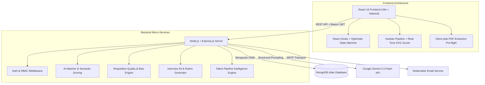

# 🏗️ Aptly.AI — System Architecture & Engineering Specifications

This document outlines the architectural decisions, system topology, AI inference pipeline, and engineering patterns behind **Aptly.AI**.

---

## 1. System Topology & Component Overview

---

## 2. Core Architectural Pillars

### 2.1 Gemini 2.5 Flash Semantic Matching Engine
- **Structured JSON Schema Enforcement:** All LLM prompts use strict JSON schema declarations to prevent hallucinations and ensure deterministic output structures.
- **Multi-Vector Scoring Breakdown:**
  - **Technical Skills Alignment (40%):** Evaluates semantic overlap across polyglot frameworks (e.g., recognizing `FastAPI` as equivalent backend competency to `Flask/Express`).
  - **Experience & Depth (30%):** Assesses years of experience, leadership scope, and production ownership.
  - **Domain Relevance (20%):** Quantifies alignment with industry sector (Fintech, HealthTech, Enterprise SaaS).
  - **Education & Credentials (10%):** Evaluates degree relevance and recognized certifications.
- **Diagnostic Skill Gap Analysis:** Generates targeted explanations for missing competencies rather than binary pass/fail rejections.

### 2.2 ATS Kanban State Machine
- **Stages:** `applied` $\rightarrow$ `shortlisted` $\rightarrow$ `interviewing` $\rightarrow$ `offered` $\rightarrow$ `rejected`.
- **Optimistic UI Updates:** Drag-and-drop actions immediately transition UI state while asynchronously dispatching atomic MongoDB `$set` updates.
- **Audit Logging:** Every stage transition records timestamps, operator IDs, and automated candidate notification triggers.

### 2.3 Real-Time JD Quality Scorer & Bias Detector
- **Multi-Metric Scoring System (0–100):**
  - **Clarity & Overview:** Clear role expectations and team structure.
  - **Specificity & Qualifications:** Distinguishes mandatory hard requirements from nice-to-haves.
  - **Inclusivity & Tone:** Scans for gender-biased or exclusionary language (e.g., replacing *"rockstar/ninja"* with collaborative terminology).
  - **Market Competitiveness:** Salary range transparency, tech stack modernness, and benefits clarity.
- **Sub-Second SVG Circular Gauge:** High-performance dynamic SVG stroke-dashoffset rendering with zero canvas overhead.

---

## 3. Data Model & Indexing Strategy

- **`User` Collection:** Stores hashed credentials (`bcryptjs`, cost factor 10), roles (`candidate` | `recruiter`), and profile metadata.
- **`Job` Collection:** Full-text indexed on `title`, `description`, `skillsRequired`, and `location` for sub-10ms query times.
- **`Application` Collection:** Compound unique index on `{ jobId: 1, candidateId: 1 }` preventing duplicate applications.
- **`Interview` Collection:** Indexed on `{ applicationId: 1, scheduledDate: 1 }` for instant agenda queries.

---

## 4. Security & Compliance

- **Authentication:** Stateless JWT bearer tokens with expiration enforcement.
- **Authorization:** Granular Role-Based Access Control (RBAC) middleware verifying persona capabilities on all mutating endpoints.
- **Sanitization:** Strict payload validation via schema sanitizers and helmet HTTP security headers.
